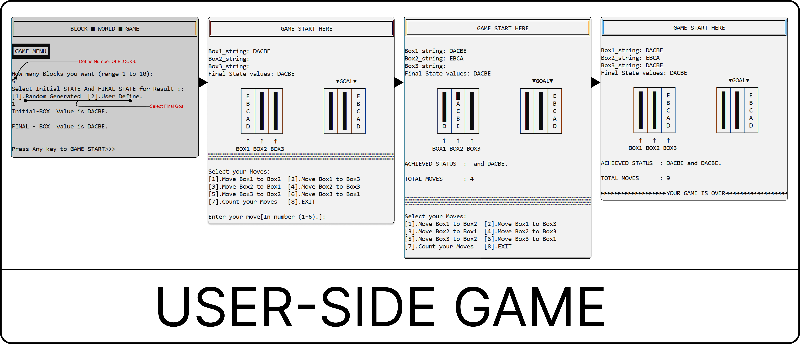

# Block Worlds Game in C

## Description

This project is a Block Worlds game implemented in C. It simulates a puzzle where blocks need to be arranged in a particular configuration, adhering to specific rules, to reach the desired goal state.

The game involves manipulating blocks within a world, moving them around to achieve a predefined structure. This implementation offers a console-based interface for users to interact with the game and solve block arrangement challenges.



## Table of Contents

1. [Installation](#installation)
2. [Usage](#usage)
3. [Features](#features)
4. [Contributing](#contributing)

## Installation


Note : Put Both file(The Block World.c & mystack.h) in same folder to execute program.😃👍
To run the game, ensure you have a C compiler installed. Clone the repository to your local machine:

```bash
git clone https://github.com/your-username/block-worlds-game-c.git
```

Compile the code using your preferred C compiler:

```bash
gcc -o block_worlds_game main.c
```

Run the executable:

```bash
./block_worlds_game
```

## Usage

Follow the on-screen instructions to play the Block Worlds game. Use commands or inputs to move blocks and solve the puzzles. Detailed instructions on gameplay will be presented within the game.

## Features

- Console-based interface for gameplay
- Block manipulation functionalities

## Contributing

Contributions are welcome! If you'd like to contribute to this project, feel free to fork the repository and submit pull requests. Please adhere to the project's coding style and guidelines.


